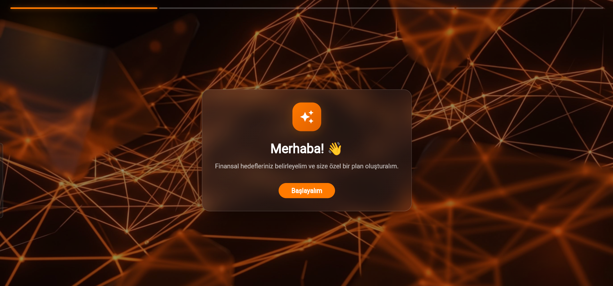
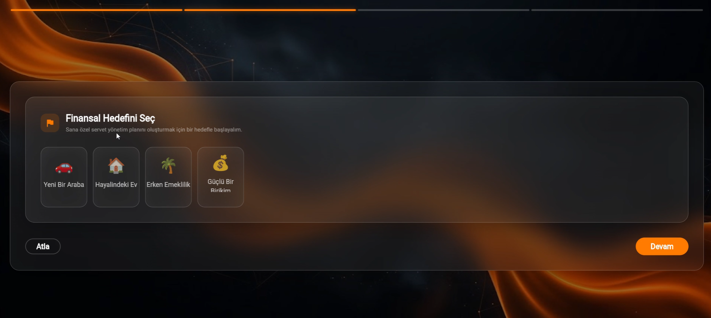
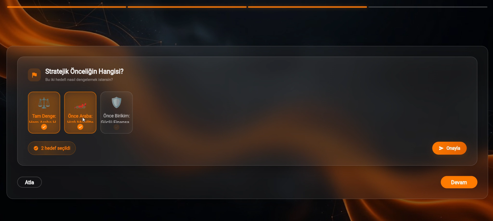
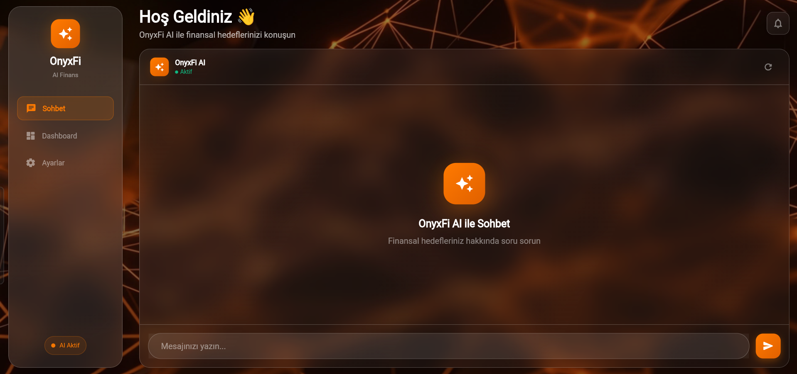
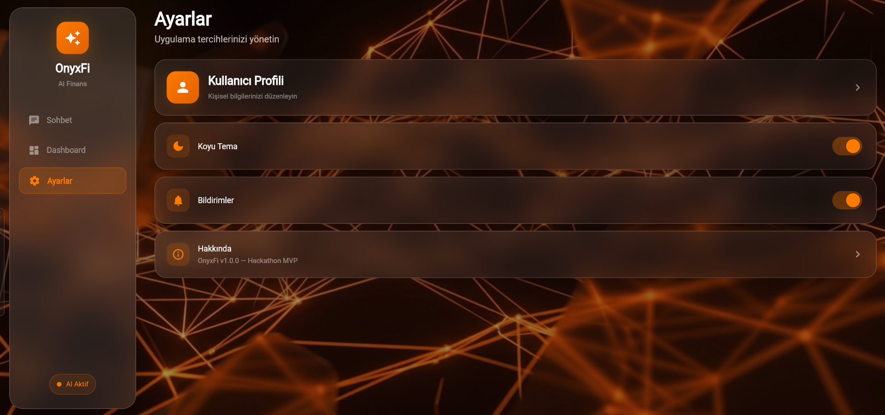

<h1 align="center">🔶 OnyxFi</h1>
<h3 align="center"><em>The Future of Agentic Personal Finance</em></h3>

<p align="center">
  <strong>AI-powered wealth simulator that replaces chat walls with interactive financial widgets.</strong>
</p>

<p align="center">
  
  
  
  
  
</p>

<p align="center">
  <a href="#-the-problem">Problem</a> •
  <a href="#-our-solution">Solution</a> •
  <a href="#-core-features">Features</a> •
  <a href="#%EF%B8%8F-technical-architecture">Architecture</a> •
  <a href="#-design-system">Design</a> •
  <a href="#-getting-started">Get Started</a>
</p>

---

## 🚨 The Problem

Traditional AI financial assistants share a critical UX flaw: **cognitive overload through walls of text.**

When a user asks *"How should I save for a house?"*, existing chatbots return 500+ words of dense financial advice — paragraphs about compound interest, risk diversification, and budgeting rules. The user reads the first two sentences, glazes over, and closes the app.

> **78% of users abandon AI chat interfaces within the first 3 interactions** due to information density and lack of actionability.
> 
> The problem isn't the AI's intelligence — it's the **interface**.

Plain text is the wrong medium for financial planning. Numbers need **charts**. Choices need **buttons**. Goals need **cards**. Projections need **visualizations**.

---

## 💡 Our Solution

**OnyxFi** doesn't just *talk* about your finances — it **renders** them.

We built the first **Generative UI (GenUI)** personal finance assistant. Instead of returning paragraphs of text, our AI agent dynamically generates **interactive Flutter widgets** — goal selection cards, input fields, projection charts, and alert badges — directly inside the conversation flow.

The AI doesn't just *tell* you to save ₺2,000/month. It **shows** you a live projection chart of your wealth growth over 10 years, lets you **adjust** the savings slider, and **reacts** with updated strategic advice in real-time.

```
┌─────────────────────────────────────────────────────────────┐
│                                                             │
│   Traditional Chatbot          OnyxFi (GenUI)               │
│   ─────────────────          ────────────────               │
│                                                             │
│   "You should save           ┌─────────────────────┐        │
│    ₺2,000 per month          │  🏠  🚗  🎓  🏖️    │        │
│    for 10 years to           │  Pick your goals    │        │
│    reach your goal           │  [Interactive Cards] │        │
│    of buying a house.        └─────────────────────┘        │
│    Consider investing                                       │
│    in index funds with       ┌─────────────────────┐        │
│    a 7% annual return.       │  📈 Wealth Growth    │        │
│    Also, you should          │  ▓▓▓▓▓▓▓▓░░ 83%    │        │
│    create an emergency       │  [Live Chart]       │        │
│    fund first..."            └─────────────────────┘        │
│                                                             │
│   😴 User left.              🎯 User engaged.              │
│                                                             │
└─────────────────────────────────────────────────────────────┘
```

### How It Works

1. **User speaks naturally** → *"I want to buy a car"*
2. **Gemini AI understands intent** → Determines the best UI widget to render
3. **A2UI protocol streams JSON** → Two-step `createSurface` + `updateComponents`
4. **Flutter renders the widget** → Interactive `GoalSelectionCard` appears in chat
5. **User interacts** → Selection feeds back to AI for the next step
6. **Loop continues** → AI adapts, deepens, and builds the financial plan visually

---

## ✨ Core Features

### 🎯 Conversational Onboarding
No forms. No sign-up walls. The AI greets you warmly (in Turkish), validates your goals with strategic insights, and dynamically generates selection cards for financial objectives — Home, Car, Retirement, Education, Travel, Emergency Fund.

### 📊 Generative Interactive Charts
When enough data is collected, the AI renders `FinancialProjectionChart` widgets powered by `fl_chart` — showing compound growth projections, savings timelines, and investment scenarios. The data points are **computed and structured by the AI itself**.

### 🤖 Agentic Co-Pilot
OnyxFi doesn't just answer questions — it **orchestrates the entire financial planning journey**:
- Celebrates your goal selection with strategic context
- Asks follow-up questions via multi-choice `GoalSelectionCard` widgets (e.g., "Car preference: Economy vs. Luxury vs. Electric?")
- Gradually collects financial data through contextual `DynamicInputField` widgets
- Surfaces warnings and opportunities via `AlertActionBadge` components

### 🎨 Glassmorphic Premium UI
Every interaction feels premium. The "Ambient Transparent Glass" design system uses backdrop blur, frost borders, and Solar Orange accents over a deep Midnight Ink background — creating a spatial, depth-rich experience.

---

## 📸 Screenshots

<p align="center">
  
</p>

<p align="center">
  
  
</p>

<p align="center">
  
  
</p>

---

## 🏗️ Technical Architecture

```
┌────────────────────────────────────────────────────────────────┐
│                        OnyxFi Architecture                      │
├────────────────────────────────────────────────────────────────┤
│                                                                │
│  ┌──────────────────────────────────────────────────────────┐  │
│  │                    FLUTTER FRONTEND                       │  │
│  │                                                          │  │
│  │  ┌─────────────┐  ┌──────────────┐  ┌────────────────┐  │  │
│  │  │ Onboarding  │  │  Dashboard   │  │   Settings     │  │  │
│  │  │    View     │  │    View      │  │    View        │  │  │
│  │  └──────┬──────┘  └──────┬───────┘  └────────────────┘  │  │
│  │         │                │                               │  │
│  │  ┌──────┴────────────────┴───────┐                       │  │
│  │  │     GenUI Surface Engine      │                       │  │
│  │  │  ┌─────────────────────────┐  │                       │  │
│  │  │  │  SurfaceController      │  │                       │  │
│  │  │  │  ├─ GoalSelectionCard   │  │                       │  │
│  │  │  │  ├─ DynamicInputField   │  │                       │  │
│  │  │  │  ├─ ProjectionChart     │  │                       │  │
│  │  │  │  └─ AlertActionBadge    │  │                       │  │
│  │  │  └─────────────────────────┘  │                       │  │
│  │  └──────────────┬────────────────┘                       │  │
│  │                 │                                         │  │
│  │  ┌──────────────┴────────────────┐                       │  │
│  │  │  A2uiTransportAdapter        │                       │  │
│  │  │  └─ A2uiParserTransformer    │                       │  │
│  │  └──────────────┬────────────────┘                       │  │
│  └─────────────────┼────────────────────────────────────────┘  │
│                    │  Streaming Chunks                          │
│  ┌─────────────────┴────────────────────────────────────────┐  │
│  │                  GOOGLE GEMINI API                         │  │
│  │           gemini-3-flash-preview                          │  │
│  │    System Instruction: A2UI v0.9 Protocol                 │  │
│  │    + Empathetic Wealth Manager Persona                    │  │
│  └──────────────────────────────────────────────────────────┘  │
│                                                                │
│  ┌──────────────────────────────────────────────────────────┐  │
│  │                   PYTHON BACKEND                          │  │
│  │         FastAPI + Supabase (PostgreSQL)                   │  │
│  │    User profiles, financial data persistence              │  │
│  └──────────────────────────────────────────────────────────┘  │
│                                                                │
└────────────────────────────────────────────────────────────────┘
```

### Frontend — Flutter & VGV GenUI SDK

| Component | Technology | Purpose |
|-----------|-----------|---------|
| **Framework** | Flutter 3.11+ | Cross-platform (Web, Android, iOS) |
| **GenUI Engine** | `genui: ^0.8.0` (by Very Good Ventures) | A2UI protocol parsing, surface lifecycle management |
| **State Management** | Provider | App-wide state (onboarding progress, navigation) |
| **Charts** | `fl_chart` | Financial projection visualizations |
| **Networking** | `google_generative_ai` | Direct Gemini API streaming |
| **Config** | `flutter_dotenv` | Secure API key management |

### AI Engine — Google Gemini 3 Flash Preview

The AI operates under a **strict system instruction** that enforces:

- **A2UI v0.9 Protocol**: Every widget render requires a two-step JSON sequence — `createSurface` (registers the surface with a unique ID and catalog reference) followed by `updateComponents` (populates with flat component definitions).
- **Empathetic Persona**: The model acts as a premium Wealth Manager, never asking for raw financial numbers immediately. It validates choices with rich encouragement, discusses strategic implications, and gradually deepens the conversation.
- **Structured Output Discipline**: All natural language text is completed BEFORE any A2UI JSON blocks are emitted — preventing chaotic interleaving that would break the parser.

### Backend — Python, FastAPI & Supabase

| Component | Technology | Purpose |
|-----------|-----------|---------|
| **API Framework** | FastAPI | RESTful endpoints for user data |
| **Database** | Supabase (PostgreSQL) | User profiles, financial goals, session persistence |
| **Auth** | Supabase Auth | Secure user authentication |

---

## 🎨 Design System

### "Ambient Transparent Glass" — Midnight Ledger Theme

OnyxFi's visual identity is built on a custom design system inspired by spatial computing interfaces and premium fintech aesthetics.

| Token | Value | Usage |
|-------|-------|-------|
| **Midnight Ink** | `#0A0A0F` → `#141420` | Primary background gradient |
| **Solar Orange** | `#FF6B35` | Accent color, CTAs, active states |
| **Frost Border** | `rgba(255,255,255, 0.20)` | Glass panel edge definition |
| **Snow White** | `#F5F5F7` | Heading text |
| **Silver Mist** | `#B0B0B8` | Body text |
| **Stone Grey** | `#6B6B78` | Captions, secondary text |

### Glass Morphism Stack

Every UI panel follows a strict layering protocol:

```
ClipRRect (border-radius: 20px)
  └─ BackdropFilter (blur: 20px)
       └─ Container
            ├─ gradient: white 7% → white 5% (top-left to bottom-right)
            ├─ border: 1px solid rgba(255,255,255, 0.20) — "Frost Border"
            └─ box-shadow: 0 8px 32px rgba(0,0,0, 0.30)
```

### Typography

| Scale | Size | Weight | Tracking |
|-------|------|--------|----------|
| **Heading** | 32px | 700 (Bold) | -0.025 |
| **Subheading** | 20px | 600 (Semi) | -0.022 |
| **Body** | 16px | 400 (Regular) | -0.020 |
| **Body SM** | 14px | 400 (Regular) | -0.013 |
| **Caption** | 12px | 400 (Regular) | -0.007 |

**Font**: Inter (Google Fonts) — Optimized for financial data legibility.

---

## 🚀 Getting Started

### Prerequisites

- **Flutter** 3.11+ ([Install Guide](https://docs.flutter.dev/get-started/install))
- **Python** 3.10+ (for the backend)
- **Google Gemini API Key** ([Get one here](https://aistudio.google.com/apikey))

### 1. Clone the Repository

```bash
git clone https://github.com/ErenBalkis/OnyxFi.git
cd OnyxFi
```

### 2. Configure Environment Variables

Create a `.env` file in the project root:

```env
# Flutter — Gemini AI Engine
GEMINI_API_KEY=your_gemini_api_key_here

# Python Backend — Supabase
SUPABASE_URL=your_supabase_url_here
SUPABASE_KEY=your_supabase_key_here
```

### 3. Install Flutter Dependencies

```bash
flutter pub get
```

### 4. Run the Flutter App

```bash
# Web (recommended for demo)
flutter run -d chrome

# Android
flutter run -d android

# iOS
flutter run -d ios
```

### 5. Run the Python Backend (Optional)

```bash
pip install -r requirements.txt
uvicorn main:app --reload --port 8000
```

---

## 📁 Project Structure

```
onyxfi/
├── lib/
│   ├── main.dart                          # App entry point & Provider setup
│   ├── core/
│   │   ├── constants/colors.dart          # Midnight Ledger color tokens
│   │   ├── theme/app_theme.dart           # Full ThemeData implementation
│   │   └── network/gemini_client.dart     # Gemini API + A2UI system instruction
│   ├── catalog/
│   │   ├── component_registry.dart        # OnyxCatalog — widget registry
│   │   ├── goal_selection_card.dart        # Interactive goal picker widget
│   │   ├── dynamic_input_field.dart        # Contextual data input widget
│   │   ├── financial_projection_chart.dart # fl_chart visualization widget
│   │   └── alert_action_badge.dart         # Warning/opportunity badge widget
│   ├── views/
│   │   ├── onboarding_view.dart           # Conversational onboarding flow
│   │   └── dashboard_view.dart            # Main chat + analytics + settings
│   ├── widgets/
│   │   ├── glass_container.dart           # Reusable glassmorphic panel
│   │   └── chat_bubble.dart               # Styled message bubble
│   └── models/
│       ├── onboarding_state.dart          # Onboarding progress state
│       └── chat_message.model.dart        # Chat message data model
├── main.py                                # FastAPI backend entry point
├── database.py                            # Supabase client configuration
├── .env                                   # API keys (gitignored)
└── pubspec.yaml                           # Flutter dependencies
```

---

## 🏆 BTK Hackathon '26

<table>
<tr>
<td width="120" align="center">
<strong>Team</strong><br/>
SyncDev
</td>
<td width="180" align="center">
<strong>Category</strong><br/>
Agentic AI + FinTech
</td>
<td width="180" align="center">
<strong>AI Model</strong><br/>
Gemini 3 Flash Preview
</td>
<td width="180" align="center">
<strong>Key Innovation</strong><br/>
Generative UI (A2UI v0.9)
</td>
</tr>
</table>

---

<p align="center">
  <strong>Built with 🔶 by Team SyncDev</strong><br/>
  <em>Where artificial intelligence meets intentional design.</em>
</p>
